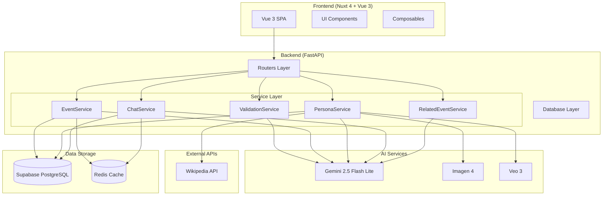
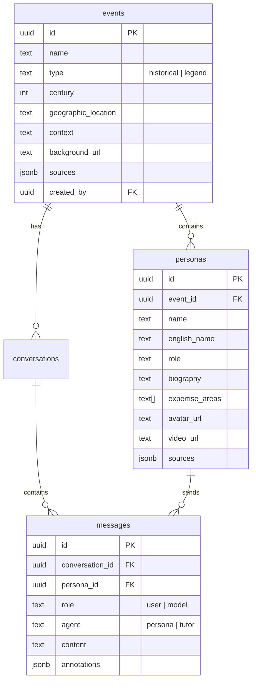

<p align="center">
  
</p>

<h1 align="center">🏛️ Ehco of History</h1>

<p align="center">
  <strong>穿越時空與真實歷史人物對話的沉浸式 AI 平台</strong>
</p>

<p align="center">
  <a href="#功能特色">功能特色</a> •
  <a href="#llm-應用架構">LLM 應用架構</a> •
  <a href="#技術架構">技術架構</a> •
  <a href="#快速開始">快速開始</a> •
  <a href="#api-文件">API 文件</a>
</p>

<p align="center">
  
  
  
  
  
</p>

---

## 📖 專案簡介

**Ehco of History (歷史迴響)** 是一個創新的 AI 驅動歷史教育平台，讓使用者能夠與真實歷史人物進行沉浸式對話。透過 **Workflow-based LLM 架構**，結合 Google Gemini 2.5、Imagen 4 和 Veo 3 等多模態 AI 技術，我們將歷史文獻轉化為可互動的「數位分身」。

### ✨ 核心亮點

| 特色 | 說明 |
|------|------|
| 🎭 **角色扮演 AI** | 每位歷史人物都有獨特的性格、語氣和知識邊界 |
| 🖼️ **AI 生成視覺** | 自動生成歷史場景背景和人物肖像 |
| 🎬 **動態影片人物** | 使用 Veo 3 生成會動的歷史人物影片 |
| 📚 **知識卡片標註** | 自動識別並解釋歷史專有名詞 |
| 🔗 **關聯事件導航** | 對話中提及的事件可一鍵探索 |
| 🛡️ **雙重驗證機制** | LLM 二次查核防止虛構人物 |

---

## 🧠 LLM 應用架構

本系統採用 **Workflow-based LLM Application** 架構，結合精細的 **Prompt Engineering** 與動態 **Context Engineering**。

### 架構定位

```
簡單 ◀────────────────────────────────────────────▶ 複雜

┌──────────┐   ┌──────────────┐   ┌──────────┐   ┌──────────┐
│ Prompt   │   │  Workflow    │   │ Agentic  │   │  Multi-  │
│ Engineer │   │  ⭐ 本系統   │   │ Workflow │   │  Agent   │
└──────────┘   └──────────────┘   └──────────┘   └──────────┘
```

### 核心設計理念

| 層面 | 技術 | 本系統實現 |
|------|------|-----------|
| **Prompt Engineering** | 指令設計、輸出控制 | 12+ 精心設計的 Prompt 模板 |
| **Context Engineering** | 動態資訊組裝 | 對話歷史 + 人物傳記 + 事件背景注入 |
| **Workflow** | 多步驟編排 | 預定義流程 + 並行優化 + Fallback 策略 |
| **Multi-Modal** | 跨模態整合 | 文字 (Gemini) + 圖片 (Imagen) + 影片 (Veo) |

---

### 🔄 事件初始化流程 (Event Initialization Workflow)

```
用戶輸入: "赤壁之戰"
         │
         ▼
┌─────────────────────────────────────────────────────────────────┐
│  STAGE 1: 輸入驗證 (ValidationService)                          │
│  ┌─────────────────────────────────────────────────────────┐   │
│  │ LLM Call: VALIDATE_HISTORICAL_RELEVANCE_PROMPT          │   │
│  │ 判斷: historical (正史) / legend (傳說) / invalid       │   │
│  └─────────────────────────────────────────────────────────┘   │
└─────────────────────────────────────────────────────────────────┘
         │ is_valid?
         ▼
┌─────────────────────────────────────────────────────────────────┐
│  STAGE 2: 事件分析 (EventService)                               │
│  ┌─────────────────────────────────────────────────────────┐   │
│  │ LLM Call: ANALYZE_EVENT_PROMPT                          │   │
│  │ 輸出: 結構化事件資料 (名稱、世紀、地點、背景、來源)       │   │
│  │ 強制: JSON 格式 + 來源驗證                               │   │
│  └─────────────────────────────────────────────────────────┘   │
└─────────────────────────────────────────────────────────────────┘
         │
         ▼
┌─────────────────────────────────────────────────────────────────┐
│  STAGE 3: 人物提取 + 二次驗證 (PersonaService)                   │
│  ┌─────────────────────────────────────────────────────────┐   │
│  │ LLM Call 1: EXTRACT_PERSONAS_PROMPT                     │   │
│  │ 提取 3-5 位關鍵歷史人物                                  │   │
│  └─────────────────────────────────────────────────────────┘   │
│                           │                                     │
│                           ▼                                     │
│  ┌─────────────────────────────────────────────────────────┐   │
│  │ LLM Call 2: VERIFY_PERSONAS_PROMPT  [Double-Check]      │   │
│  │ 剔除虛構人物、驗證真實性                                 │   │
│  └─────────────────────────────────────────────────────────┘   │
└─────────────────────────────────────────────────────────────────┘
         │
         ▼
┌─────────────────────────────────────────────────────────────────┐
│  STAGE 4: 多模態資源生成 (並行執行)                              │
│                                                                  │
│  ┌─────────────────┐  ┌─────────────────┐  ┌─────────────────┐ │
│  │ 場景背景生成     │  │ 人物頭像獲取     │  │ 動態影片生成    │ │
│  │ (Imagen 4)      │  │ (Wiki → Imagen) │  │ (Veo 3)        │ │
│  └─────────────────┘  └─────────────────┘  └─────────────────┘ │
│                              │                                   │
│               ┌──────────────┼──────────────┐                   │
│               ▼              ▼              ▼                   │
│         [Wikipedia]    [AI 生成]      [預設頭像]                 │
│          優先搜尋    Fallback Lv1   Fallback Lv2                │
└─────────────────────────────────────────────────────────────────┘
         │
         ▼
      儲存至 Supabase
```

---

### 💬 對話流程 (Chat Workflow)

```
用戶訊息: "這場仗怎麼打的？"
         │
         ▼
┌─────────────────────────────────────────────────────────────────┐
│                      並行執行區塊                                │
│  ┌─────────────────────────────────────────────────────────┐   │
│  │                    主流程 (Sequential)                   │   │
│  │                                                          │   │
│  │  Step 1: SELECT_PERSONA_PROMPT                          │   │
│  │  根據問題內容選擇最適合回答的人物                         │   │
│  │  軍事問題 → 將領 | 民生問題 → 文官                        │   │
│  │                    │                                     │   │
│  │                    ▼                                     │   │
│  │  Step 2: PERSONA_RESPONSE_PROMPT                        │   │
│  │  以選定人物身份生成第一人稱回應                           │   │
│  │  注入: 人物傳記 + 事件背景 + 對話歷史                     │   │
│  │                    │                                     │   │
│  │                    ▼                                     │   │
│  │  Step 3: EXTRACT_ANNOTATIONS_PROMPT                     │   │
│  │  提取專有名詞並生成知識卡片解釋                           │   │
│  └─────────────────────────────────────────────────────────┘   │
│                                                                  │
│  ┌─────────────────────────────────────────────────────────┐   │
│  │              背景任務 (Parallel)                         │   │
│  │                                                          │   │
│  │  DETECT_RELATED_EVENTS                                  │   │
│  │  從對話中偵測關聯歷史事件                                 │   │
│  │  + GENERATE_DYNAMIC_CONTEXT                             │   │
│  │  生成動態情境描述                                        │   │
│  └─────────────────────────────────────────────────────────┘   │
└─────────────────────────────────────────────────────────────────┘
         │
         ▼
    組裝回應 (Response + Annotations + Related Events)
```

---

### 📝 Prompt Engineering 技術細節

#### 1. 結構化約束

```python
LANGUAGE_REQUIREMENTS = """
**嚴格語言規範:**
1. **必須 100% 使用繁體中文 (Traditional Chinese, zh-TW)**
2. **絕對禁止在中文句子中直接插入英文單詞**
3. **英文使用規則:**
   - ✅ 正確: 專有名詞採用「中文(English)」格式
   - ❌ 錯誤: "這個決定的 roots 可以追溯..."
"""
```

#### 2. 防幻覺機制 (Anti-Hallucination)

```python
# 人物提取 Prompt 中的防捏造要求
"""
**嚴格防捏造與驗證要求 (Anti-Hallucination):**
1. **絕對禁止虛構人物**: 只輸出歷史上**真實存在**的人物
2. **禁止通用角色**: 不要輸出「某位士兵」等非具體人物
3. **自我驗證機制**: 輸出前檢核是否能在 Wikipedia 找到
4. **寧缺勿濫**: 找不到就不輸出，不要湊數
"""

# 二次驗證 Prompt
VERIFY_PERSONAS_PROMPT = """
你是一位嚴格的歷史事實查核員 (Historical Fact-Checker)。
驗證人物列表，剔除虛構、捏造或非具體的人物...
"""
```

#### 3. 角色扮演約束

```python
PERSONA_RESPONSE_PROMPT = """
**角色扮演核心原則:**
1. **第一人稱視角** - 以「我」敘述
2. **歷史準確性** - 所有回應必須符合史實
3. **時代世界觀** - 用該時代人的思維方式思考
4. **真實情感** - 分享個人困境、掙扎、信念
5. **角色一致性** - 絕不透露你是 AI
"""
```

#### 4. 來源驗證要求

```python
"""
**資料來源嚴格要求:**
✅ 可接受: Wikipedia、學術期刊、歷史教科書、經典史料
❌ 禁止: 新聞報導、個人部落格、社群媒體

**來源格式:**
- Wikipedia: 必須提供完整 URL
- 學術書籍: "《書名》，作者，出版社，年份"
- 至少包含 1 個 Wikipedia 來源
"""
```

---

### 🔧 Context Engineering 實現

#### 動態 Context 組裝

```python
# chat_service.py
async def generate_response(self, persona, event_context, user_message, history):
    
    # Context 1: 對話歷史過濾
    history_text = "\n".join([
        f"{msg['role']}: {msg['content']}"
        for msg in history
        if msg.get('agent') != 'tutor'  # 過濾無關訊息
    ])
    
    # Context 2: 人物專長
    expertise = ", ".join(persona.get("expertise_areas", []))
    
    # Context 3: 組裝完整 Prompt
    prompt = PERSONA_RESPONSE_PROMPT.format(
        persona_name=persona["name"],
        persona_biography=persona["biography"],  # 人物傳記
        event_context=event_context,             # 事件背景
        expertise_areas=expertise,               # 專長領域
        history=history_text,                    # 對話歷史
        user_message=user_message
    )
```

#### Context 注入結構

```
┌─────────────────────────────────────────────────────────────┐
│                    LLM 輸入 (Final Prompt)                   │
├─────────────────────────────────────────────────────────────┤
│                                                              │
│  ┌────────────────────────────────────────────────────────┐ │
│  │ STATIC: Prompt Template (角色設定、輸出約束、語言規範)  │ │
│  └────────────────────────────────────────────────────────┘ │
│                           +                                  │
│  ┌────────────────────────────────────────────────────────┐ │
│  │ DYNAMIC CONTEXT:                                       │ │
│  │  • persona_biography: 人物傳記 (從 DB 查詢)            │ │
│  │  • event_context: 事件背景 (從 DB 查詢)                │ │
│  │  • expertise_areas: 專長領域 (從 DB 查詢)              │ │
│  │  • history: 對話歷史 (過濾後)                          │ │
│  │  • user_message: 當前用戶訊息                          │ │
│  └────────────────────────────────────────────────────────┘ │
│                                                              │
└─────────────────────────────────────────────────────────────┘
```

---

### 📊 LLM 調用統計

| 功能 | LLM 調用次數 | 模型 | 說明 |
|------|-------------|------|------|
| 事件初始化 | 3-4 次 | Gemini 2.5 | 驗證 + 分析 + 提取 + 驗證 |
| 圖片生成 | 1-3 次 | Imagen 4 / Gemini | 視覺分析 + 生成 (含 Fallback) |
| 單次對話 | 3-4 次 | Gemini 2.5 | 選人 + 回應 + 標註 + 關聯事件 |
| 影片生成 | 1 次 | Veo 3 | Image-to-Video |

---

## 🎯 功能特色

### 1. 智慧歷史事件生成
輸入任何歷史主題（如「赤壁之戰」、「法國大革命」），系統自動：
- ✅ 驗證並分類事件類型（正史 / 傳說）
- ✅ 提取 3-5 位關鍵歷史人物（含二次驗證）
- ✅ 生成沉浸式歷史場景背景圖
- ✅ 建立完整的歷史背景脈絡
- ✅ 提供可驗證的學術來源

### 2. 動態人物選擇系統
用戶提問時，AI 會根據問題內容自動選擇最適合回答的人物：

| 問題類型 | 選擇傾向 | 範例 |
|---------|---------|------|
| 軍事戰略 | 將領/指揮官 | 「這場仗怎麼打的？」→ 選周瑜 |
| 政治外交 | 謀士/文官 | 「為何要聯合抗曹？」→ 選諸葛亮 |
| 民生文化 | 學者/詩人 | 「當時百姓生活如何？」→ 選文人 |

### 3. 沉浸式對話體驗
- 🎭 第一人稱角色扮演
- ⏱️ 嚴格的知識邊界（不會提及該時代之後的事件）
- 🎨 符合人物性格的語氣模擬
- 📚 自動生成知識卡片標註

### 4. 多模態 AI 整合

```
┌─────────────┐     ┌─────────────┐     ┌─────────────┐
│   Gemini    │     │   Imagen    │     │    Veo     │
│   2.5 Flash │     │      4      │     │     3      │
├─────────────┤     ├─────────────┤     ├─────────────┤
│ • 事件分析   │     │ • 場景背景   │     │ • 動態頭像   │
│ • 人物提取   │     │ • 人物肖像   │     │ • 說話動畫   │
│ • 對話生成   │     │ • 油畫風格   │     │ • 5秒影片   │
│ • 標註提取   │     │             │     │             │
└─────────────┘     └─────────────┘     └─────────────┘
```

### 5. 三層圖片獲取策略 (Fallback Chain)

```
嘗試 1: Wikipedia 搜尋
    │
    ├─ 成功 → 使用 Wikipedia 圖片
    │
    └─ 失敗 ↓
    
嘗試 2: Imagen 4 生成 (詳細 Prompt)
    │
    ├─ 成功 → 使用 AI 生成圖片
    │
    └─ 失敗 (安全過濾) ↓
    
嘗試 3: Imagen 4 生成 (簡化 Prompt)
    │
    ├─ 成功 → 使用 AI 生成圖片
    │
    └─ 失敗 → 使用預設頭像
```

---

## 🏗️ 技術架構

### 系統架構圖



### 技術棧

| 層級 | 技術 | 版本 | 說明 |
|------|------|------|------|
| **Frontend** | Nuxt | 4.x | SSR/SPA 混合渲染 |
| **Frontend** | Vue | 3.5 | Composition API |
| **Styling** | Tailwind CSS | 3.x | 原子化 CSS 框架 |
| **Backend** | FastAPI | 0.115 | 高效能非同步 API |
| **Backend** | Python | 3.11+ | 主要開發語言 |
| **Database** | Supabase | - | PostgreSQL + Auth + RLS |
| **Cache** | Redis | 7 | API Response 快取 |
| **AI - LLM** | Gemini | 2.5 Flash Lite | 文本生成與邏輯判斷 |
| **AI - Image** | Imagen | 4 | 場景與肖像生成 |
| **AI - Video** | Veo | 3 | 動態人物影片生成 |

### 目錄結構

```
Ehco_of_history/
├── 📁 backend/                    # Python FastAPI 後端
│   ├── 📁 auth/                   # 認證模組 (JWT)
│   │   ├── dependencies.py        # get_current_user_optional()
│   │   └── jwt_handler.py         # Supabase JWT 驗證
│   ├── 📁 database/               # 資料庫連接
│   │   └── connection.py          # Supabase Client (單例)
│   ├── 📁 models/                 # Pydantic 資料模型
│   │   ├── requests.py            # API 請求模型
│   │   └── responses.py           # API 回應模型
│   ├── 📁 routers/                # API 路由
│   │   ├── chat.py                # POST /api/chat
│   │   ├── events.py              # /api/events, /api/event/initialize
│   │   ├── conversations.py       # 對話管理
│   │   ├── persona_cards.py       # 人物卡牌 API
│   │   └── talking_head.py        # 動態影片 API
│   ├── 📁 services/               # 業務邏輯層 ⭐
│   │   ├── validation_service.py  # 輸入驗證 (歷史相關性)
│   │   ├── event_service.py       # 事件分析與管理
│   │   ├── persona_service.py     # 人物提取、驗證、圖片生成
│   │   ├── chat_service.py        # 對話生成、標註提取
│   │   ├── related_event_service.py # 關聯事件偵測
│   │   └── background_service.py  # 背景圖生成
│   ├── 📁 utils/                  # 工具函數
│   │   ├── prompts.py             # 🧠 所有 Prompt 模板
│   │   ├── gemini_client.py       # Gemini API 封裝
│   │   └── cache.py               # Redis 快取工具
│   ├── 📁 video_generation/       # Veo 影片生成
│   ├── 📁 static/                 # 靜態檔案
│   │   ├── avatars/               # 人物頭像
│   │   ├── backgrounds/           # 場景背景
│   │   └── videos/                # 動態影片
│   ├── main.py                    # FastAPI 應用入口
│   ├── config.py                  # 環境變數配置
│   └── requirements.txt           # Python 依賴
│
├── 📁 components/                 # Vue 元件
│   ├── ChatScreen.vue             # 聊天介面 (含動態情境、關聯事件)
│   ├── AnnotatedText.vue          # 知識卡片標註元件
│   ├── BookInputForm.vue          # 書籍風格輸入框
│   ├── PersonaInputForm.vue       # 現代風格輸入框
│   ├── HistoricalFiguresList.vue  # 人物列表 (含動態頭像)
│   ├── ImmersiveLoading.vue       # 沉浸式載入動畫
│   └── PersonaCardModal.vue       # 人物卡牌彈窗
│
├── 📁 pages/                      # Nuxt 頁面
│   ├── index.vue                  # 首頁 (事件輸入 + 事件列表)
│   ├── chat.vue                   # 聊天頁面
│   ├── tutorial.vue               # 教學導覽
│   └── profile.vue                # 個人資料
│
├── 📁 composables/                # Vue Composables
│   └── useAuth.ts                 # Supabase Auth 邏輯
│
├── 📁 types/                      # TypeScript 類型定義
│
├── ⚙️ nuxt.config.ts              # Nuxt 配置 (API Proxy)
└── ⚙️ tailwind.config.js          # Tailwind 配置 (歷史主題色)
```

---

## 🚀 快速開始

### 環境需求

- **Node.js** 18.0+
- **Python** 3.11+
- **pnpm** 8.0+ (推薦)

### 環境變數設定

建立 `.env` 檔案於專案根目錄：

```env
# Google AI API (必填)
GEMINI_API_KEY=your_gemini_api_key

# Supabase (必填)
SUPABASE_URL=https://your-project.supabase.co
SUPABASE_KEY=your_supabase_anon_key
SUPABASE_JWT_SECRET=your_jwt_secret  # 帳號系統需要

# Redis (選用)
REDIS_URL=redis://localhost:6379
```

### 本地開發

```bash
# 1. 安裝後端依賴
cd backend
python -m venv venv
source venv/bin/activate  # Windows: venv\Scripts\activate
pip install -r requirements.txt

# 2. 安裝前端依賴
cd ..
pnpm install

# 3. 啟動後端 (Terminal 1)
cd backend
uvicorn main:app --reload --port 8000

# 4. 啟動前端 (Terminal 2)
pnpm dev
```

訪問 `http://localhost:3000`

---

## 📡 API 文件

### 主要端點

#### 事件初始化

```http
POST /api/event/initialize
Content-Type: application/json

{
  "event_name": "赤壁之戰",
  "rebuild": false
}
```

**Response:**
```json
{
  "event": {
    "id": "uuid",
    "name": "赤壁之戰",
    "type": "historical",
    "century": 3,
    "context": "...",
    "background_url": "/static/backgrounds/..."
  },
  "personas": [...],
  "conversation_id": "uuid"
}
```

#### 聊天

```http
POST /api/chat
Content-Type: application/json

{
  "conversation_id": "uuid",
  "user_message": "這場仗怎麼打的？",
  "history": [...]
}
```

**Response:**
```json
{
  "response": "我周瑜記得那一天...",
  "selected_persona": {
    "id": "uuid",
    "name": "周瑜",
    "role": "東吳大都督"
  },
  "annotations": [
    {
      "text": "火攻",
      "explanation": "赤壁之戰的決定性戰術..."
    }
  ],
  "related_events": [
    {
      "event_name": "官渡之戰",
      "is_explorable": true
    }
  ],
  "dynamic_context": "⚔️ 探討赤壁之戰的軍事部署與火攻戰術"
}
```

### Swagger UI

啟動後端後訪問：`http://localhost:8000/docs`

---

## 🗄️ 資料庫結構

### ER Diagram



### Row Level Security (RLS)

| 資料表 | 訪客 | 登入用戶 |
|--------|------|---------|
| `events` | 共用事件 | 共用 + 自己建立的 |
| `personas` | 共用事件的人物 | 共用 + 自己建立的 |
| `conversations` | ❌ | 只看自己的 |
| `messages` | ❌ | 只看自己的 |

---

## 📊 效能優化

### 並行處理

聊天 API 採用 `asyncio.gather` 並行優化：

```python
# 主流程與背景任務並行
related_events_task = asyncio.create_task(
    related_event_service.detect_related_events(...)
)

# 執行主流程 (Step 3-7)
selected_persona = await persona_service.select_best_persona(...)
response_text = await chat_service.generate_response(...)
annotations = await chat_service.extract_annotations(...)

# 等待背景任務
result = await related_events_task
```

### 快取策略

| 層級 | 技術 | TTL | 說明 |
|------|------|-----|------|
| API Response | Redis | 1 hour | 事件列表、人物列表 |
| 靜態檔案 | Nuxt public assets | - | 頭像、背景圖 |
| LLM 結果 | - | 不快取 | 保持回應多樣性 |

---

## 🧪 測試

```bash
cd backend

# 檢查資料庫連線
python tests/check_connection.py

# 檢查人物頭像
python tests/check_avatars.py

# 檢查人物資料完整性
python tests/check_all_personas.py

# 檢查英文殘留
python tests/check_english_messages.py
```

---

## 📄 授權條款

本專案採用 MIT 授權條款

---

## 🙏 致謝

- [Google Gemini](https://ai.google.dev/) - LLM 能力
- [Google Imagen](https://deepmind.google/technologies/imagen-3/) - 圖片生成
- [Google Veo](https://deepmind.google/technologies/veo/) - 影片生成
- [Supabase](https://supabase.com/) - 資料庫與認證
- [Nuxt](https://nuxt.com/) - Vue.js 全端框架
- [FastAPI](https://fastapi.tiangolo.com/) - Python Web 框架

---

<p align="center">
  Made with ❤️ for History Education
</p>

