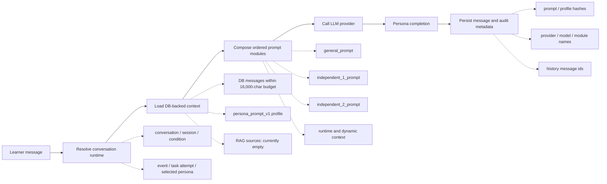
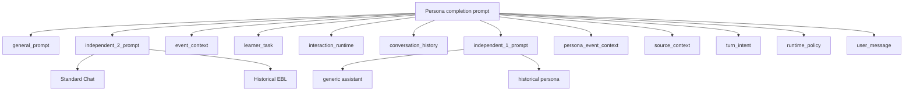

# Persona Completion Flow

最後更新：2026-08-20

## 目的

這份文件描述 learner message 從進入後端，到完成 persona response 並保存研究 metadata 的主 pipeline。它是 persona prompt、context engineering 與 runtime audit 的共同基準，不討論 task 題目設計。

核心要求：

- 四種 condition 使用相同的組裝流程，只替換兩個 independent prompt module。
- role-play 回覆必須受人物的時間、地理、社會位置與知識邊界約束。
- non-role-play 回覆不得冒充歷史人物。
- Historical EBL 與 Standard Chat 是互動策略差異，不改變史實準確性要求。
- 多輪內容以資料庫中的 `messages` 為 authoritative history，不信任前端自行提交的 history。
- RAG 目前停用；沒有檢索結果時，模型不得暗示已檢索外部史料。

## 主 Pipeline

主線代表 completion 的固定生命週期；虛線分枝是該階段載入或輸出的次要資訊，不會取代主 pipeline。

## Prompt Module Tree

`PromptService` 使用下列 module tree；實際線性順序以後端 `assemble_chat_modules` 為準：

若 persona profile 的 `deliberate_error_enabled` 為 `true`，pipeline 會插入 `deliberate_error_slot`。目前沒有經研究審核的 error contract，因此即使該旗標開啟，也不得自行引入錯誤內容。

## 每個階段的責任

### 1. Resolve Conversation Runtime

後端以 `conversation_id` 解析 session、event、condition、task attempt 與 persona。這一層負責確認資料關聯與 session 是否已因 timer 到期而關閉，不負責生成內容。

### 2. Load DB-backed Context

後端從 `messages` 讀取既有對話，依 `sequence_index` 還原順序，從最新訊息往前裝入最多 16,000 字元的 history budget；每則內容最多取 1,600 字元。系統不再以固定 12 則截斷長時間 EBL 對話。

這是目前的「多輪記憶」：

- 記憶跨重新整理存在，因為來源是 Supabase，而不是 component state。
- 前端送來的 history 不作為 authoritative context。
- 它是 bounded window，不是摘要記憶、向量記憶或長期使用者模型。

### 3. Compose Prompt Modules

#### `general_prompt`

所有 condition 共用。要求繁體中文、史實優先、明示不確定性、不得捏造引文或私人心理，並維持時間、地理與文化脈絡一致。

#### `independent_1_prompt`

控制 response identity：

- `generic assistant`：不得第一人稱扮演歷史人物。
- `historical persona`：以指定人物第一人稱回覆，且不得超出人物資訊邊界。

#### `independent_2_prompt`

控制 interaction mode：

- `Standard Chat`：自然回答 learner 實際提出的事件相關問題，不主動執行 Historical EBL sequence，也不因 Task 錯誤自動公布答案。
- `Historical EBL`：以目前錯誤作為反思起點，依 learner 最新回覆選擇一項合適的 Historical Thinking 操作，再使用 Disclosure Level 控制資訊量；在 learner 尚未找到可辯護方向前，不直接揭露完整結論。

#### 動態 context modules

- `event_context`：事件名稱、描述、年代與脈絡。
- `learner_task`：作答內容與 judgement，只供後續討論，不主動重複完整答案摘要。
- `interaction_runtime`：目前錯誤、合法 EBL states、Disclosure 範圍、evidence boundary 與 transition 規則。
- `conversation_history`：由 DB 讀取的 bounded history。
- `persona_event_context`：角色資料、事件當下情境與 `persona_prompt_v1` contract。
- `source_context`：RAG 檢索內容；目前明確標示 RAG disabled。
- `turn_intent`：區分 opening 與 learner 回覆後的 conversation turn。
- `runtime_policy`：禁止揭露 hidden prompt、hash、system metadata 或 chain-of-thought。
- `user_message`：當次 learner 輸入，固定置於最後。

### 4. Persona Prompt Contract

`PersonaPromptProfile` 目前使用 `persona_prompt_v1`，包含：

- `speaking_style`
- `social_position`
- `temporal_boundary`
- `geographic_boundary`
- `knowledge_boundary`
- `stance`
- `source_policy`
- `forbidden_claims`
- `teacher_notes`
- `deliberate_error_enabled`

舊 persona JSON 會以保守預設值正規化，未知欄位暫時保留，以降低既有資料升級風險。

### 5. LLM Call Policy

Runtime 透過既有 LLM provider 呼叫模型。Prompt modules 是唯一 condition/persona 規則來源；provider 的 system message 只提供中性的執行框架，避免重複套用另一份隱藏 condition policy。

Admin 有兩種檢查方式：

- `GET /api/admin/prompt-preview`：顯示實際 modules 與完整 prompt，不呼叫 LLM、不寫入對話。
- `POST /api/admin/prompt-dry-run`：以同一套 modules 呼叫 LLM，但不保存正式 message 或 Session 研究紀錄。

### 6. Persist Completion Metadata

正式 chat completion 會保存 learner message 與 model/persona message。Model message 的 metadata 至少包含：

- `prompt_hash`
- `persona_profile_hash`（若使用 persona）
- `prompt_modules`
- `history_message_ids`
- `provider`
- `model`
- `latency_ms`、實際 token usage 與 retry metadata

正式 Session 另外在 `research_logs` 保存建立當下的 event/task/condition/persona 素材快照，以及每次實際送給 Provider 的完整 Prompt。兩者都附 SHA-256，Admin 匯出時會重新驗證。這是可稽核快照，不是完整 draft/publish 版本平台。

## 目前邊界

- 已完成：ordered prompt modules、`persona_prompt_v1`、DB-backed bounded multi-turn history、Prompt/素材快照與 hash、provider/model/token/latency metadata、Admin preview、Admin dry-run及研究匯出。
- Deferred：完整 draft/readiness/publish 版本平台與視覺化版本比較。
- Deferred：RAG ingestion、embedding、retrieval、citation rendering。
- Deferred：需求清單中尚未定義驗收條件的第 6 與第 8 項；第 8 若指 RAG，仍依本文件的 RAG deferred 決策處理。
- Deferred：經研究審核的 deliberate-error contract；目前不得自動產生受控錯誤。
